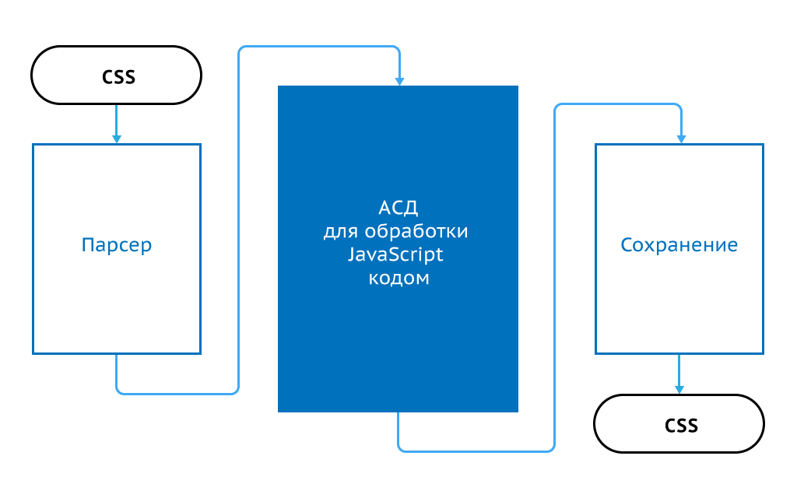

---

layout: bright
author: Алексей Иванов
default_lang: ru
progress: false

style: |
    .slide::after, .list .badge {
        display: none;
    }
    .slide.with-2-sides pre,
    .slide.with-2-sides p {
        float: left;
        clear: left;
        width: 350px;
    }
    .slide.with-2-sides pre:nth-of-type(2),
    .slide.with-2-sides p:nth-of-type(2) {
      float: right;
      clear: right;
    }
    .slide.with-2-codes pre {
        float: left;
        clear: left;
        width: 350px;
    }
    .slide.with-2-codes pre:nth-of-type(2) {
        float: right;
        clear: right;
    }
    .slide pre code:before {
        display: none;
    }
    .slide.with-bigger-right pre {
        width: 260px;
    }
    .slide.with-bigger-right pre:nth-of-type(2) {
        width: 440px;
    }
    .slide.with-small-code pre {
        font-size: 70%;
    }
    .slide.with-small-code pre code {
        line-height: 1.8;
    }
    .slide.with-js-inout pre:nth-of-type(2),
    .slide.with-js-inout  p:nth-of-type(1) {
        float: left;
        clear: left;
        width: 350px;
    }
    .slide.with-js-inout pre:nth-of-type(3),
    .slide.with-js-inout p:nth-of-type(2) {
        width: 350px;
        float: right;
        clear: right;
    }
    .emphasis {
        text-align: center;
        font-size: 3em;
        font-weight: bold;
        line-height: 1;
        padding-top: 80px;
    }
    .slide table td {
        background: none;
    }
    #Cover h2 {
        margin:30px 0 0;
        color:#FFF;
        text-align:center;
        font-size:70px;
    }
    .dark-cover h2 {
        color:#FFF;
        text-shadow: 2px 2px #000;
        //margin: -50px 0 0 -50px;
    }
    #Cover p {
        margin:10px 0 0;
        text-align:center;
        color:#FFF;
        font-style:italic;
        font-size:20px;
        }
    #Cover p a {
        color:#FFF;
    }
    .copyright {
        color: #999;
        position: absolute;
        bottom: 50px;
        left: 128px;
        font-size: 75%;
    }
---

# Зачем нужны постпроцессоры при живых препроцессорах {#Cover}

*[Алексей Иванов](https://twitter.com/iadramelk), компания [JetStyle](http://www.jetstyle.ru/)*

## О чем этот доклад

1. Почему чистого css мало для счастливой жизни.
2. Плюсы и минусы препроцессоров.
3. Что такое постпроцессы и чем они хороши.
4. Почему постпроцессоры становятся популярны именно сейчас.
5. Как сделать свой постпроцессор.

## Появление CSS
{:.cover}
{:.dark-cover}

## &nbsp;
{:.cover}

## &nbsp;
{:.cover}

## &nbsp;
{:.cover}

## &nbsp;
{:.cover}

## &nbsp;
{:.cover}

## Появление Ruby-программистов

Ruby-программисты смотрят на css-код
{:.emphasis}

## Ruby-программисты создают SASS
{:.cover}

1. Переменные
2. Вложенные селекторы
3. Простая математика

## К SASS добавляются LESS и Stylus
{:.cover}

1. Переменные
2. Вложенные селекторы
3. Простая математика

## Возможности препроцессоров начинают бурно развиваться

+----------------------------|----------------------------------|
| 1. Переменные              | 6. Примеси                       |
| 2. Вложенные селекторы     | 7. Функции                       |
| 3. Простая математика      | 8. Циклы for                     |
| 4. Массивы                 | 9. Условные операторы if .. else |
| 5. Наследование селекторов | 10. Ссылки на свойства           |

## Наконец-то настал Золотой Век css! &nbsp;

+----------------------------|----------------------------------|
| 1. Переменные              | 6. Примеси                       |
| 2. Вложенные селекторы     | 7. Функции                       |
| 3. Простая математика      | 8. Циклы for                     |
| 4. Массивы                 | 9. Условные операторы if .. else |
| 5. Наследование селекторов | 10. Ссылки на свойства           |

## Наконец-то настал Золотой Век css! ... \\...или нет?

+----------------------------|----------------------------------|
| 1. Переменные              | 6. Примеси                       |
| 2. Вложенные селекторы     | 7. Функции                       |
| 3. Простая математика      | 8. Циклы for                     |
| 4. Массивы                 | 9. Условные операторы if .. else |
| 5. Наследование селекторов | 10. Ссылки на свойства           |

## &nbsp;
{:.cover}

## Какие из-за этого возникают проблемы?
1. Возможности препроцессоров можно применять только через их специальный синтаксис.
5. ...Собственный язык, который браузеры не понимают.
2. ...Невозможность модификации обычных css-файлов (кроме Stylus'а).
3. ...Скорость рендеринга.
4. ...На большинстве проектов используется только маленький процент возможностей препроцессоров.

## **Новая надежда! Rework**

## &nbsp;
{:.cover}

## **Ну а сейчас-то Золотой Век?**

## **Ну...**

## Что такое постпроцессор?

**Постпроцессор** – это библиотека **а)** принимающая на вход css, **б)** преобразующая его тем или иным образом и **в)** сохраняющая на диск снова как css.

## Примеры постпроцессоров

1. ...[CSSO](https://github.com/css/csso) – минификация css.
2. ...[CSSComb](https://github.com/csscomb/csscomb.js) – изменение порядка выбора правил.
3. ...[cssrb](https://github.com/afelix/cssrb) – библиотека для замены ссылок на ресурсы в css файлах.
4. ...[Autoprefixer](https://github.com/postcss/autoprefixer) – автоматическое добавление префиксов.

## Что изменил Rework?
Появился простой, быстрый и удобный фреймворк для создания постпроцессоров:

1. ...Автоматический парсинг и сборка css.
2. ...Удобный JavaScript API для работы с разобранным кодом.
3. ...Куча дополнительной информации о коде – номера строк, имена файлов, типы селекторов.
4. ...Поддержка карт кода.

## **Rework** – первый,  но не единственный

1. [Rework](https://github.com/reworkcss/rework) – самый старый, больше всего плагинов.
2. [PostCSS](https://github.com/postcss/postcss) – лучше поддержка карт кода, сохраняет форматирование, много дополнительных хелперов, более надежный парсер.
3. [CSSComb-core](https://github.com/csscomb/core) – самый универсальный парсер, поддержка синтаксиса SASS и LESS, нет карт кода.

## Пример: [grunt-webpcss](https://github.com/lexich/grunt-webpcss) на PostCSS
{:.with-2-codes}
{:.with-small-code}

<pre>
    <code><mark>.icon </mark>{</code>
    <code>    <mark>background</mark>: url('a.png')</code>
    <code>}</code>
</pre>
<pre>
    <code><mark>.icon </mark>{</code>
    <code>    <mark>background</mark>: url('a.png')</code>
    <code>}</code>
    <code><mark><mark class="important">.webp</mark> .icon </mark>{
</code>
    <code>    <mark>background</mark>: url('a<mark class="important">.webp</mark>')</code>
    <code>}</code>
</pre>

Пример кода из доклада <a href="http://ai.github.io/about-postcss/">PostCSS: будущее после Sass и LESS</a>

## Пример:  [autoprefixer](https://github.com/postcss/autoprefixer) на PostCSS
{:.with-2-codes}
{:.with-small-code}
{:.slide.with-bigger-right}

<pre>
    <code><mark>.box </mark>{</code>
    <code>    <mark>flex-shrink:</mark> 0;</code>
    <code>    <mark>flex-basis:</mark> 300px;</code>
    <code>}</code>
</pre>
<pre>
    <code><mark>.box </mark>{</code>
    <code>    <mark>-webkit-flex-shrink:</mark> 0;</code>
    <code>    <mark>    -ms-flex-negative:</mark> 0;</code>
    <code>    <mark>        flex-shrink:</mark> 0;</code>
    <code>    <mark>-webkit-flex-basis:</mark> 300px;</code>
    <code>    <mark>    -ms-flex-preferred-size:</mark> 300px;</code>
    <code>    <mark>        flex-basis:</mark> 300px;</code>
    <code>}</code>
</pre>

Пример кода из доклада <a href="http://ai.github.io/about-postcss/">PostCSS: будущее после Sass и LESS</a>

## Пример: [rtlcss](https://github.com/MohammadYounes/rtlcss) на PostCSS
{:.with-2-codes}
{:.with-small-code}

Изменяет дизайн для&nbsp;арабского и&nbsp;иврита

<pre>
    <code><mark>a </mark>{</code>
    <code>    <mark class="important">left</mark>: 10px;</code>
    <code>    <mark>text-align</mark>: <mark class="important">left</mark>;</code>
    <code>}</code>
</pre>
<pre>
    <code><mark>a </mark>{</code>
    <code>    <mark class="important">right</mark>: 10px;</code>
    <code>    <mark>text-align</mark>: <mark class="important">right</mark>;</code>
    <code>}</code>
</pre>

Пример кода из доклада <a href="http://ai.github.io/about-postcss/">PostCSS: будущее после Sass и LESS</a>

## Другие способы использования

1. Создание спрайтов.
2. Группировка селекторов по медиавыражениям.
3. Объединение файлов.
4. Тысячи других.

## Как использовать

1. Отдельные библиотеки с CLI.
2. grunt и gulp плагины.
3. Через node.js.

## Свой постпроцессор. Проблема

**Современные браузеры:**

<pre>
    <code>a<mark class="important">::</mark>after { }</code>
</pre>

**Для IE 8:**

<pre>
    <code>a<mark class="important">:</mark>after { }</code>
</pre>

Пример кода из доклада <a href="http://ai.github.io/about-postcss/">PostCSS: будущее после Sass и LESS</a>

## Свой постпроцессор. PostCSS

<pre>
    <code><mark>var</mark> coloner = postcss(<mark>function</mark> (css) {
</code>
    <code>    css.eachRule(<mark>function</mark> (rule) {
</code>
    <code>        <mark>if</mark> ( rule.selector.match(<mark>/::/</mark>) )
</code>
    <code>            rule.selector += <mark>', '</mark> +
</code>
    <code>                rule.selector.replace(<mark>'::'</mark>, <mark>':'</mark>);
</code>
    <code>    });</code>
    <code>});</code>
</pre>

Пример кода из доклада <a href="http://ai.github.io/about-postcss/">PostCSS: будущее после Sass и LESS</a>

## Свой постпроцессор. Результат
{:.with-js-inout}

<pre>
    <code><mark>var</mark> fixed = coloner.process(css).css;
</code>
</pre>

Вход:

Выход:

<pre>
    <code><mark>a::after </mark>{</code>
    <code>    <mark>content</mark>: "→"</code>
    <code>}</code>
</pre>
<pre>
    <code><mark>a::after<mark class="important">, a:after</mark> </mark>{
</code>
    <code>    <mark>content</mark>: "→"</code>
    <code>}</code>
</pre>

Пример кода из доклада <a href="http://ai.github.io/about-postcss/">PostCSS: будущее после Sass и LESS</a>

## Резюме

1. ...Препроцессоры это хорошо – но не для всех задач.
2. ...Многое из того что сейчас делаются через препроцессоры или руками, гораздо проще делать через постпроцессоры.
3. ...Есть множество готовых постпроцессоров на все случаи жизни.
4. ...Свои постпроцессоры писать очень просто и быстро.
5. ...Пробуйте, пишите, экспериментируйте, выкладывайте на Github.
6. ...Задавайте вопросы если вам что-то непонятно – вам обязательно помогут!

## Вопросы?

*Twitter:* &nbsp; [@iadramelk](https://twitter.com/iadramelk)    
*Почта:* &nbsp; [stupidlogin@gmail.com](mailto:stupidlogin@gmail.com)    
*Github:*  &nbsp; [github.com/iAdramelk](https://github.com/iAdramelk/)
